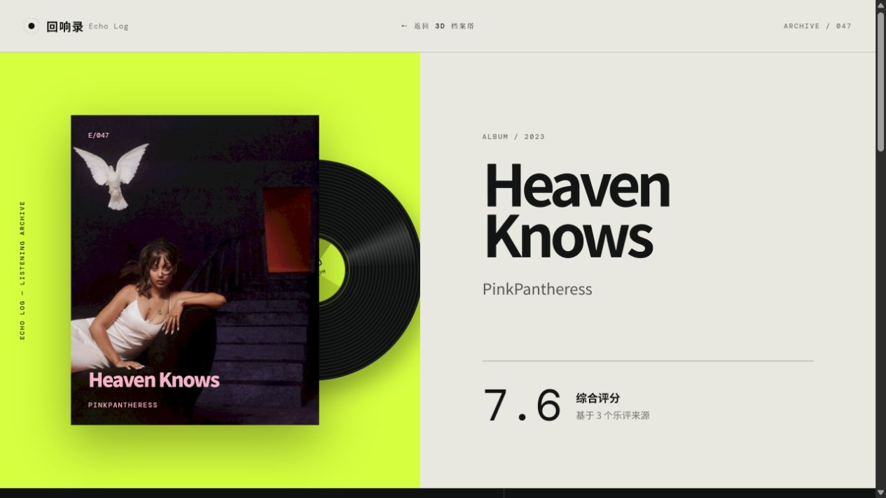
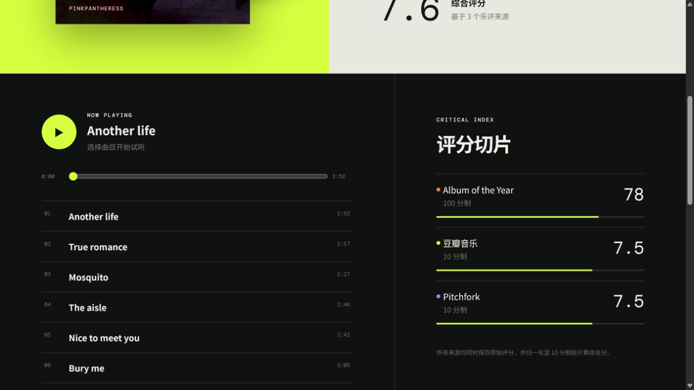
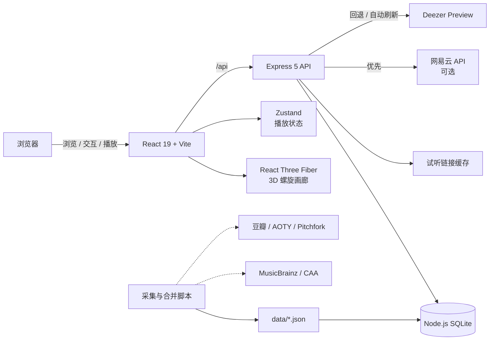
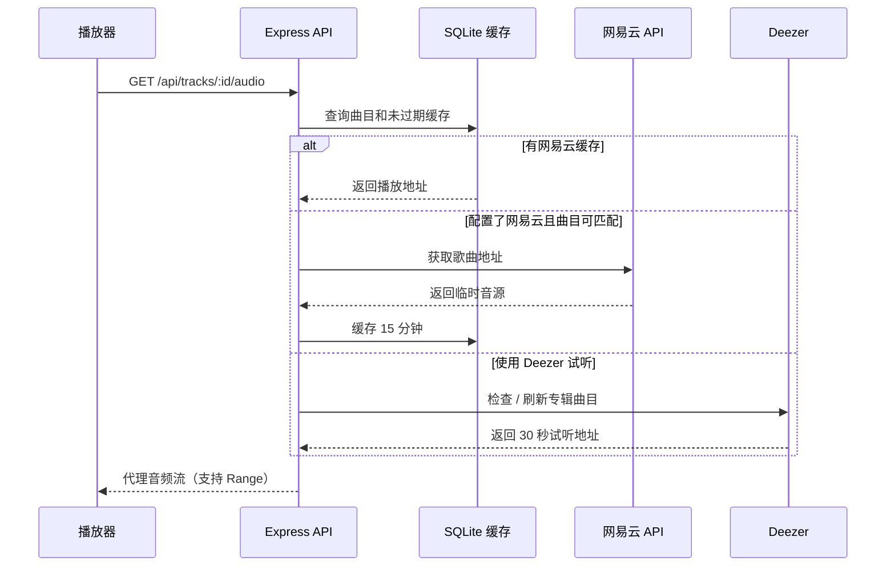
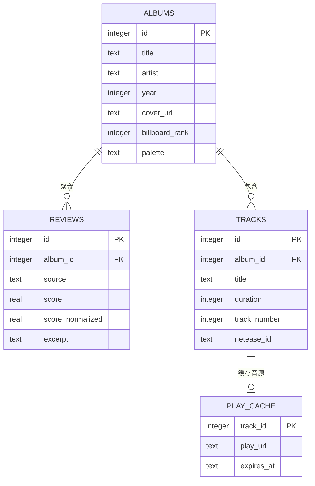

<div align="center">
  

  <h1>回响录 · Echo Log</h1>

  <p><strong>把散落在不同平台的乐评、评分与试听片段，重新组织成一座可以旋转探索的 3D 唱片档案塔。</strong></p>

  <p>
    
    
    
    
    
  </p>
</div>

> 上图为项目本地实际运行截图：等待全部 99 张远程专辑封面加载完成后拍摄；数据集中唯一没有远程封面的专辑会使用程序化回退纹理。100 张专辑由 React Three Fiber / Three.js 实时渲染为可拖拽、缩放和自动旋转的 3D 螺旋档案塔。

## 项目简介

**回响录（Echo Log）** 是一个乐评聚合音乐播放器 MVP。首页以 3D 螺旋档案塔呈现 100 张专辑；打开专辑后，可以查看豆瓣音乐、Album of the Year 与 Pitchfork 等来源的评分切片、精选短评和曲目列表，并播放由服务端实时解析、转发的真实歌曲试听片段。

它不只是“专辑榜单”，而是一个偏策展式的聆听入口：用统一的视觉语言，把不同评分尺度、评论文本与声音重新放回同一张唱片周围。

## 真实界面与页面跳转

### 从 3D 档案塔进入专辑详情

点击 3D 塔中的任意专辑封面，页面会先显示开启档案的过渡卡片，再跳转至 `/album/:id`。下图为从首页实际点击专辑后进入的 `Heaven Knows` 详情页，展示专辑封面、黑胶唱片动效、艺人、年份与综合评分。



### 曲目播放与多来源评分

详情页向下滚动即可查看真实试听播放器、曲目列表，以及 Album of the Year、豆瓣音乐和 Pitchfork 的原始评分与归一化评分条。



## 功能一览

| 模块 | 能力 |
| --- | --- |
| 3D 唱片档案塔 | 使用 React Three Fiber 渲染 100 张专辑封面，支持拖拽旋转、缩放、悬停反馈与自动巡游 |
| 专辑详情 | 展示封面、黑胶动效、发行年份、曲目、综合评分和精选乐评 |
| 多源评分聚合 | 保存来源原始分数，并统一归一化到 10 分制后计算综合评分 |
| 真实试听音源 | 优先使用配置的网易云音源；不可用时自动刷新并代理 Deezer 30 秒试听 |
| 容错封面 | 远程封面缺失或加载失败时，自动生成与专辑色板匹配的程序化封面 |
| 本地数据层 | 使用 Node.js 内置 SQLite，无需单独安装数据库服务；首次启动自动建表并导入种子数据 |
| 数据采集工具 | 提供豆瓣、AOTY、Pitchfork、MusicBrainz、Cover Art Archive 与 Deezer 的采集/合并脚本 |
| 运维接口 | 提供健康检查、数据统计和受 `ADMIN_KEY` 保护的手动刷新接口 |

## 系统架构



### 一次播放请求如何完成



## 技术栈

- **前端：** React 19、React Router、Zustand、Three.js、React Three Fiber、Drei
- **后端：** Node.js、Express 5、Node Cron
- **数据：** Node.js 内置 `node:sqlite`、JSON 种子数据
- **构建：** Vite 7、npm、Concurrently
- **外部数据：** MusicBrainz、Cover Art Archive、Deezer，以及可选的网易云音乐 API

## 快速开始

### 1. 环境要求

- Node.js **22.5+**（项目使用内置 `node:sqlite`）
- npm 10+
- 支持 WebGL 的现代浏览器

### 2. 安装与配置

```bash
git clone https://github.com/Yolanda-Zeng/echo-log.git
cd echo-log
npm install
```

复制环境变量模板：

```powershell
Copy-Item .env.example .env
```

macOS / Linux：

```bash
cp .env.example .env
```

默认配置已经可以启动项目；网易云 API、定时任务和管理密钥均为可选项。

### 3. 启动开发环境

```bash
npm run dev
```

启动后访问：

- Web：<http://127.0.0.1:5173>
- API：<http://127.0.0.1:8787/api>
- 健康检查：<http://127.0.0.1:8787/api/health>

首次启动时，服务端会自动创建 `data/echo-log.db`，并从 `data/seed-data.json` 导入数据；若种子文件不存在，则自动回退到内置演示数据。

## 环境变量

| 变量 | 默认值 | 必填 | 说明 |
| --- | --- | --- | --- |
| `PORT` | `8787` | 否 | Express API 监听端口 |
| `NETEASE_API_BASE` | 空 | 否 | 自部署 NeteaseCloudMusicApi 地址；配置后优先尝试网易云真实音源 |
| `CRON_ENABLED` | `false` | 否 | 是否启用每日自动刷新任务 |
| `DOUBAN_COOKIE` | 空 | 否 | 豆瓣采集 Cookie；仅采集脚本需要，使用时请遵守目标站点规则 |
| `ADMIN_KEY` | 空 | 否 | 管理接口密钥；未配置时管理接口返回 `501` |

> [!IMPORTANT]
> `.env`、SQLite 数据库、构建产物和依赖目录均已加入 `.gitignore`。请勿把 Cookie、管理密钥或其他凭据提交到仓库。

## 可用命令

| 命令 | 用途 |
| --- | --- |
| `npm run dev` | 同时启动 Vite 前端和带文件监听的 API 服务 |
| `npm run dev:web` | 仅启动前端开发服务器 |
| `npm run dev:server` | 仅启动 API 开发服务器 |
| `npm run build` | 构建生产前端到 `dist/` |
| `npm start` | 启动 Express 生产服务 |
| `npm run generate:audio` | 生成项目内的音频素材 |

数据采集脚本可按需直接执行，例如：

```bash
node scripts/fetch-album-meta.js
node scripts/fetch-douban.js
node scripts/fetch-aoty.js
node scripts/fetch-pitchfork.js
node scripts/fetch-deezer-previews.js
node scripts/merge-seed-data.js
```

建议先备份 `data/`，并阅读脚本参数与站点使用条款；采集任务可能受到频率限制、页面结构变化或网络环境影响。

## API 速览

| 方法 | 路径 | 说明 |
| --- | --- | --- |
| `GET` | `/api/health` | 服务、数据库模式和音源配置状态 |
| `GET` | `/api/albums?limit=100` | 获取专辑摘要列表，最多 100 条 |
| `GET` | `/api/albums/:id` | 获取专辑、乐评与曲目详情 |
| `GET` | `/api/tracks/:id/play` | 解析曲目播放来源并返回 JSON |
| `GET` | `/api/tracks/:id/audio` | 代理音频流，供前端播放器直接使用 |
| `POST` | `/api/admin/refresh` | 手动触发数据刷新，需要 `x-admin-key` |
| `GET` | `/api/admin/stats` | 查看数据统计，需要 `x-admin-key` |

示例：

```bash
curl http://127.0.0.1:8787/api/health
curl "http://127.0.0.1:8787/api/albums?limit=12"
curl http://127.0.0.1:8787/api/albums/1
```

## 数据模型



评分聚合时，`reviews.score` 保存来源原始分数，`reviews.score_normalized` 保存统一到 10 分制后的值；专辑综合分取所有可用来源归一化分数的算术平均值。

## 项目结构

```text
echo-log/
├─ data/                       # 种子数据、采集结果与本地 SQLite（数据库不提交）
├─ docs/                       # README 视觉素材
├─ public/                     # favicon 与静态音频资源
├─ scripts/                    # 乐评、元数据、封面和试听链接采集/合并脚本
├─ server/
│  ├─ database.js             # 数据表、种子导入与评分聚合
│  └─ index.js                # API、音频代理、缓存与定时任务
├─ src/
│  ├─ components/             # 3D 画廊、封面、播放器
│  ├─ pages/                  # 首页与专辑详情页
│  ├─ api.js                  # 前端 API 封装
│  ├─ store.js                # Zustand 播放状态
│  └─ styles.css              # 全局视觉系统与响应式布局
├─ .env.example               # 环境变量示例
├─ package.json
└─ vite.config.js
```

## 生产构建

```bash
npm run build
```

PowerShell：

```powershell
$env:NODE_ENV = "production"
npm start
```

macOS / Linux：

```bash
NODE_ENV=production npm start
```

生产模式下，Express 会提供 `dist/` 中的前端静态文件，并继续处理 `/api` 请求。部署平台需要提供可写磁盘以保存 SQLite；若平台使用临时文件系统，请将数据目录挂载到持久化存储，或改接外部数据库。

## 设计取舍与限制

- 当前是可运行 MVP，数据集固定为 100 张专辑，尚未提供搜索、筛选和用户账户。
- Deezer 试听链接带短期签名，服务端会在过期时刷新；上游服务不可用时不会回退到伪造音频。
- `node:sqlite` 适合单实例、小规模部署；多实例写入场景建议迁移到 PostgreSQL 等服务型数据库。
- 外部评分和试听内容的版权归各自权利方所有；本项目仅保存必要的元数据、摘录和链接，公开部署前请确认所在地区及数据来源的使用规则。

## 延伸文档

- [产品与开发文档](./乐评聚合音乐播放器-开发文档.md)
- [专辑数据筛选标准](./专辑数据筛选标准.md)

## 参与开发

欢迎通过 Issue 提交数据纠错、功能建议或兼容性问题。提交代码前，请至少运行一次：

```bash
npm run build
```

如果修改了数据采集逻辑，请在说明中注明数据来源、匹配策略、失败样本以及是否需要新的环境变量。

---

<div align="center">
  <sub>A log of echoes — where scattered listening becomes a shared archive.</sub>
</div>
