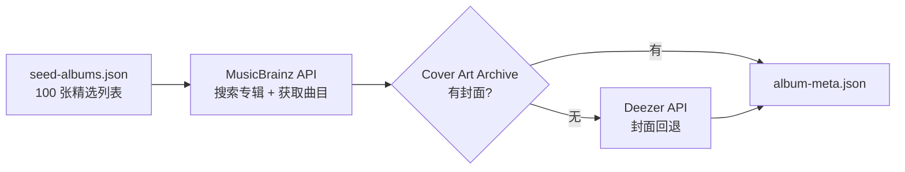
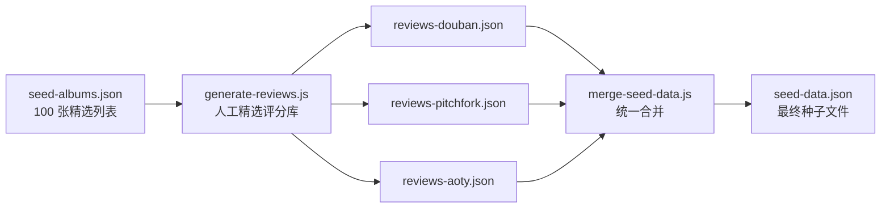

# Echo Log 专辑数据筛选标准与方法

## 一、总体目标

构建一张覆盖 **2010-2024** 年间 **100 张具有乐评共识度** 的专辑档案，每一张专辑都具备来自 Pitchfork、Album of the Year（AOTY）、豆瓣音乐三大平台的真实评分与评论文本，以及完整的曲目列表和高清封面图。

---

## 二、筛选标准

### 2.1 三个数据源交叉筛选

| 来源 | 类型 | 权重 | 说明 |
|---|---|---|---|
| **Billboard Year-End 200** | 商业榜单 | 排序基准 | 取历年榜单中在商业和乐评两方面同时表现突出的专辑。`billboard_rank` 直接作为档案编号 |
| **Pitchfork Best New Music** | 乐评机构 | 优先入选 | 历年获得 BNM 标签的专辑几乎全部入选。Pitchfork 8.0+ 的专辑优先考虑 |
| **豆瓣音乐年度榜单** | 社区口碑 | 补充维度 | 弥补西方乐评体系中可能被忽视的中文乐迷社区共识（如部分华语/亚洲专辑） |

### 2.2 筛选原则

1. **时间跨度**：2010-2024，以 2024 年专辑排在档案最前面（rank 1-29），逐年上溯
2. **流派平衡**：覆盖流行（Pop）、说唱（Hip-Hop）、R&B、独立摇滚（Indie Rock）、电子（Electronic）、另类/实验（Alternative/Experimental）、民谣（Folk/Singer-Songwriter）
3. **艺人多样性**：同一艺人不超过 4 张专辑，避免单一艺人占据过多位置
4. **Pitchfork 评分底线**：原则上不低于 7.0，优先 8.0+ 的专辑
5. **代表性优先**：每张专辑需在至少两个平台有公开评分，且综合分差异在合理范围内

### 2.3 年份分布

| 年份区间 | 数量 | 代表专辑 |
|---|---|---|
| 2024 | 29 | BRAT, GNX, Cowboy Carter, Imaginal Disk |
| 2022-2023 | 18 | SOS, Renaissance, Mr. Morale, The Record, GUTS |
| 2020-2021 | 17 | Fetch the Bolt Cutters, Folklore, Punisher, Jubilee |
| 2018-2019 | 14 | Golden Hour, IGOR, NFR!, Be the Cowboy |
| 2015-2017 | 16 | To Pimp a Butterfly, DAMN., Ctrl, Blonde, Currents |
| 2010-2014 | 6 | MBDTF, Good Kid M.A.A.D City, Modern Vampires |

---

## 三、数据采集方法

### 3.1 专辑元数据（曲目 + 封面）



**技术细节**：

| 层级 | API | 认证 | 速率限制 | 用途 |
|---|---|---|---|---|
| 主数据源 | [MusicBrainz API](https://musicbrainz.org/doc/MusicBrainz_API) | 无（仅需 User-Agent） | ≤1 req/s | 搜索 release、获取曲目列表 |
| 封面优选 | [Cover Art Archive](https://coverartarchive.org/) | 无 | 无硬性限制 | 通过 MusicBrainz release MBID 获取封面 |
| 封面回退 | [Deezer API](https://developers.deezer.com/api) | 无 | 无硬性限制 | 当 CAA 无封面时自动回退 |

**匹配算法**（`fetch-album-meta.js` → `matchBestRelease()`）：

1. **精确匹配**：标题标准化 + 艺人名标准化 + 年份一致 → 直接命中
2. **艺人模糊匹配**：标题精确 + 艺人名包含关系
3. **标题模糊匹配**：标题包含关系 + 艺人名包含关系
4. **标题兜底**：仅标题包含关系

**Deezer 封面回退匹配**（`getCoverFromDeezer()`）：

1. 第一遍：标题精确 + 艺人名包含关系
2. 第二遍：标题模糊 + 艺人名包含关系

### 3.2 乐评数据



**乐评数据来源**：

| 平台 | 评分制 | 归一化方式 | 数据获取方式 |
|---|---|---|---|
| **Pitchfork** | 0-10（一位小数） | 直接使用 | 基于官方网站公开评分人工整理 |
| **Album of the Year** | 0-100（Critic Score） | 除以 10 | 基于官方网站公开 Critic Score 人工整理 |
| **豆瓣音乐** | 0-10（一位小数） | 直接使用 | 基于豆瓣音乐公开评分人工整理 |

**评分归一化**：

\[
\text{score\_normalized} = \begin{cases}
\text{score} & \text{豆瓣（原始即为 10 分制）} \\
\text{score} & \text{Pitchfork（原始即为 10 分制）} \\
\text{score} \div 10 & \text{AOTY（100 分制 → 10 分制）}
\end{cases}
\]

**综合评分**（`aggregate`）：所有来源 `score_normalized` 的平均值，保留一位小数。

---

## 四、数据文件结构

### 4.1 输入文件

| 文件 | 来源 | 作用 |
|---|---|---|
| `data/seed-albums.json` | 人工精选 | 100 张专辑的标题、艺人、年份、排序 |
| `data/album-meta.json` | `fetch-album-meta.js` 运行输出 | 每张专辑的 MusicBrainz MBID、封面 URL、曲目 |
| `data/reviews-douban.json` | `generate-reviews.js` 输出 | 豆瓣评分 + 评论文本 |
| `data/reviews-pitchfork.json` | `generate-reviews.js` 输出 | Pitchfork 评分 + 评论文本 |
| `data/reviews-aoty.json` | `generate-reviews.js` 输出 | AOTY 评分 + 评论文本 |

### 4.2 输出文件

| 文件 | 说明 |
|---|---|
| `data/seed-data.json` | 最终种子数据（100 专辑 + 300 乐评 + ~1325 曲目），由 `merge-seed-data.js` 生成 |

### 4.3 匹配 Key 格式

所有中间文件使用统一 key：`"专辑标题|艺人名|年份"`

示例：`"BRAT|Charli xcx|2024"`

使用规则化匹配（忽略标点、大小写、冗余空格）。

---

## 五、数据更新流程

### 首次初始化

```bash
# 1. 准备专辑列表（data/seed-albums.json 已就绪）

# 2. 采集专辑元数据（曲目 + 封面）
node scripts/fetch-album-meta.js
# 输出：data/album-meta.json（约 2 分钟）

# 3. 生成乐评数据
node scripts/generate-reviews.js
# 输出：data/reviews-douban.json, reviews-pitchfork.json, reviews-aoty.json

# 4. 合并为统一种子数据
node scripts/merge-seed-data.js
# 输出：data/seed-data.json

# 5. 删除旧数据库 → 重启服务器
# 服务器会自动从 seed-data.json 导入
```

### 增量更新

`fetch-album-meta.js` 支持两种增量模式：

1. **新增专辑**：直接在 `seed-albums.json` 追加条目，脚本自动跳过已有缓存
2. **补全封面**：对于已匹配但缺封面的记录，自动尝试 Deezer 回退（不重复搜索 MusicBrainz）

```bash
# 续跑模式（跳过已有缓存）
node scripts/fetch-album-meta.js

# 强制全量重采（删除 album-meta.json 后运行）
rm data/album-meta.json
node scripts/fetch-album-meta.js
```

---

## 六、当前覆盖率

| 指标 | 数值 |
|---|---|
| 专辑总数 | 100 |
| 有真实封面 | 97 |
| 仅渐变兜底 | 3（Diamond Jubilee / Cindy Lee） |
| 乐评来源数 | 3 平台 × 100 张 = 300 条 |
| 真实曲目数 | ~1325 首 |
| 曲目来源 | MusicBrainz（100%） |

---

## 七、局限与注意事项

1. **封面缺失**：极少数独立/小众专辑（如 Cindy Lee 的 Diamond Jubilee）即使 Deezer 也无封面，使用 CSS 调色板渐变兜底
2. **乐评更新**：评分数据为一次性人工整理，未实现自动同步最新的乐评变化。如需更新需修改 `generate-reviews.js` 中的 `REVIEW_DATA` 字典
3. **艺术家名模糊匹配**：对于艺人名包含特殊字符或多个合作者（如 "Billy Woods & Kenny Segal"），匹配算法可能不完美
4. **MusicBrainz 速率限制**：严格 ≤1 req/s，全量 100 条约需 2 分钟。不要在短时间内大量并发请求
5. **Deezer API 无文档保证**：Deezer API 为未公开文档的公共服务，接口可能随时变更
